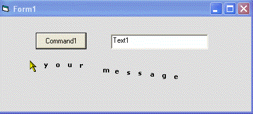



## Advertising Form Skin \(animated screenmovie\)

### Description

This is a neat and useful idea i came up with for a form skin. When offering freeware or trialware to your users this could be a useful technique. the skin causes a message, that you specify, to follow the mouse around on your form. There is also a built in "FormOnTop" property as well
 
### More Info
 

             |
---                |---
**Submitted On**   |2005-02-10 01:17:14
**By**             |[Evan Toder](https://github.com/Planet-Source-Code/PSCIndex/blob/master/ByAuthor/evan-toder.md)
**Level**          |Intermediate
**User Rating**    |5.0 (10 globes from 2 users)
**Compatibility**  |VB 3\.0, VB 4\.0 \(16\-bit\), VB 4\.0 \(32\-bit\), VB 5\.0, VB 6\.0
**Category**       |[Custom Controls/ Forms/  Menus](https://github.com/Planet-Source-Code/PSCIndex/blob/master/ByCategory/custom-controls-forms-menus__1-4.md)
**World**          |[Visual Basic](https://github.com/Planet-Source-Code/PSCIndex/blob/master/ByWorld/visual-basic.md)
**Archive File**   |[Advertisin1850902102005\.zip](https://github.com/Planet-Source-Code/evan-toder-advertising-form-skin-animated-screenmovie__1-58818/archive/master.zip)

